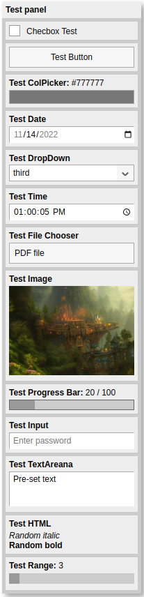

# Magx-Panel

Panel is a floating panel component, which consists of a number of elements and is usually always on top of all the other elements on user interface. The panels are very common in e.g. design tools (Photoshop, CAD tools, game engine HUDs) or during generic application debugging for finetuning the parameters of the application.

The Magx-Panel is based on [QuickSettings](https://github.com/bit101/quicksettings) project, which is not anymore in active development. QuickSettings was a pure JavaScript project, but Magx-Panel is written on top of Lit. The project has extended the functionality of some of the available elements and made possible to define panels declaratively purely on HTML markup since the Panel and its elements are standard [web components](https://en.wikipedia.org/wiki/Web_Components).

Panel uses [Lit](https://lit.dev/) as the base libray for creating the web components and [Vite](https://vitejs.dev/) as the build tool.

### Available Components

By default, Panel contains 13 elements that can be added to the panel. New elements can be created by extending a new class from the base element and following instructions on specific [sub-chapter](#adding-new-components). The currently available components are:

| Component | Example Panel |
| ---- | ----|
| Checkbox<br/><br/>Button<br/><br/>Color picker<br/><br/><br/>Date<br/><br/>Drop down<br/><br/>Time<br/><br/><br/>File Chooser<br/><br/><br/><br/>Image<br/><br/><br/><br/>Progress Bar<br/><br/>Input<br/><br/><br/>Text area<br/><br/><br/>Arbitrary HTML<br/><br/><br/>Range |  |
  
## Examples

Please check a separate [example application](https://github.com/mlalma/magx/tree/main/Panel-Test), which shows how to create panels programmatically and declaratively.

There is also a simple test page ``ìndex.html`` as a part of the Panel component itself that can be used to quickly test modifications, new elements and changes to existing codebase. The page can be accessed launching Vite in dev mode ```npm run dev``` and connecting browser to the localhost URL provided by Vite.

## How To Use

First create either ```MagxPanel``` class or declare ```<magx-panel>``` element in DOM. You can then start adding the elements to the panel either declaring them on HTML markup or then creating them programmatically and adding them as child nodes to the panel. The tag names are defined in class ```MagxPanelConstants``` and the class names are very self-explanatory. Please check the example application that shows in practice how to use the panel.

Note that the created panel is bound to its parent's screen area by default. If you want it to be unconstrained, either set attribute ```outofbounds="false"``` or call method ```.setOutOfBoundsCheck(false)```. If the parent element is moving around the screen, ```position``` property of the parent should not be ```static``` as the panel won't then move alongside the parent. However, the panel observes the resize events of the parent to automatically re-adjust the boundaries in case the out of bounds check is turned on and it works independently of the ```position``` property.

## Adding New Components

All elements are derived from base class ```MagxPanelBaseElement```. Derive your new class from it and implement ```getValue()``` and ```setValue()``` methods that are defined as abstract. These methods should return the current value of the element and change the (primary) value of the element. They are used especially by Panel for returning JSON of all the values of panel elements and bulk setting of the values.

Notice that for render() all elements need to have ```div``` element of class ```container_base``` as the root element. Most elements will also want to have a title and that can be defined with ```div``` of class ```label```:

```bash
<div class="container_base" id="container">
    <div class="label"><b>${this.title}</b></div>
    <!-- Actual component definition comes here -->
</div>
```

Other UX-related thing to observe is to add ```MagxPanelBaseElement._baseStyle``` to the styles definition of each component to keep the style in synch.

```MagxPanelBaseElement``` does initialization of ```ìd``` and ```title``` in ```firstUpdated()``` so remember to call ```super.firstUpdated()``` if you overload the method. If ```id``` is not explicitly defined it will be generated for the component.

For a very simple example check [implementation](https://github.com/mlalma/magx/blob/main/Panel/src/Panel-Image.ts) of ```MagxPanelImage```.

## Modifying Look-and-Feel

Panel uses CSS variables for setting up the look-and-feel. As an example there are two different themes taken from the original QuickSettings project that show how to vary the outlook: A light theme with larger font size depicted on the screenshot above, and a second dark theme with smaller and more compact layout. The various parts of look-and-feel can be customized by simply changing or overwriting the CSS variables.

