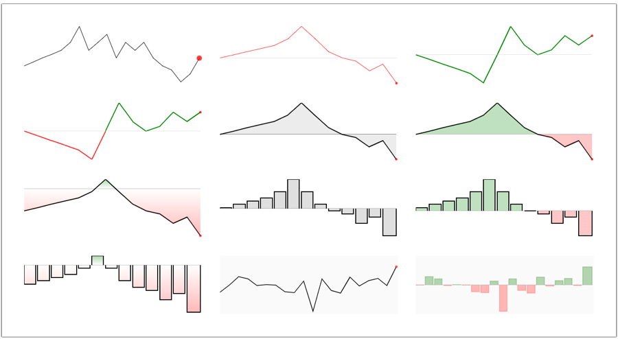

# Magx-Sparkline

[Sparkline](https://en.wikipedia.org/wiki/Sparkline) is a very plain and usually smallish chart that is used to show a variation in a measurement. It is used for providing a quick-glance and simple information without extra bells and whistles.

Magx-Sparkline uses [Lit](https://lit.dev/) as the base libray for creating the web components and [Vite](https://vitejs.dev/) as the build tool.

## Examples

See the index.html and main.ts files that show various different sparkline examples.



For viewing the examples clone this repository, install the dependencies and run vite dev server:

```bash
$ npm install
$ npm run dev
```

Then connect on your browser to the localhost URL provided by Vite. The example HTML markup and Typescript code are defined on files ```index.html``` and ```main.ts```.

## How To Use

Install the component using npm:

```bash
$ npm install magx-sparkline
```

First create either instance of ```MagxSparkline``` class or declare ```<magx-sparkline>``` element in DOM. If you declare the element in DOM, you can define multiple different attributes to customize the sparkline. Similarly you can customize the component completely programmatically.

The key values to changes are the type of the sparkline (line chart / bar chart), the outlook of the line and filling, and the reference line y-position and outlook that defines, which values are over/under zero line.

New data can be added dynamically and the total amount of data points on the sparkline can be defined at will.

The key attributes to modify are:

| Attribute | Method on class | HTML Attribute
| ---- | ---- | ---- |
| Sparkline type | setType() | type |
| Background color | setBackgroundColor() | bckgCol |
| Line / bar outline width | setLineWidth() | lineWidth |
| Line / bar type and color(s) | setLineColor() | lineType, lineColor, lineAboveCol, lineBelowCol |
| Fill color between reference line and sparkline | setFill() | fillType, fillCol, fillAboveCol, fillBelowCol |
| Reference line type | setReferenceLine() | refLineType, refLineYPos |
| Reference line width | setReferenceLineWidth() | refLineWidth |
| Reference line color | setReferenceLineColor() | refLineColor |  
| Endpoint marker color and radius | setEndpoint() | endpointCol, endpointRadius |
| Set lower bound limit | setLowerBound() | lowerBound |
| Set upper bound limit | setUpperBound() | upperBound |
| Cap values on lower bound | setCap() | capBelow |
| Cap values on upper bound | setCap() | capAbove |
| Set data | setDataPointNum(), addDatapoint(), setData() | data |

